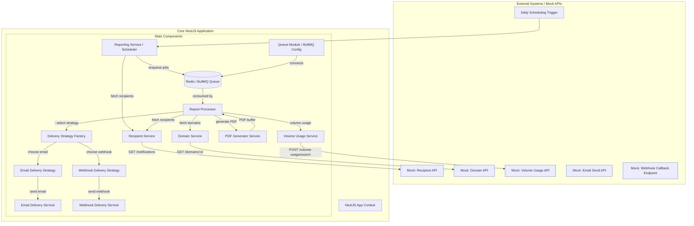

# Architecture Overview
This document provides an overview of the architecture for the Reporting Service, which is designed to handle email and webhook notifications based on recipient data and domain information. The service is built using NestJS and utilizes BullMQ for job processing.

